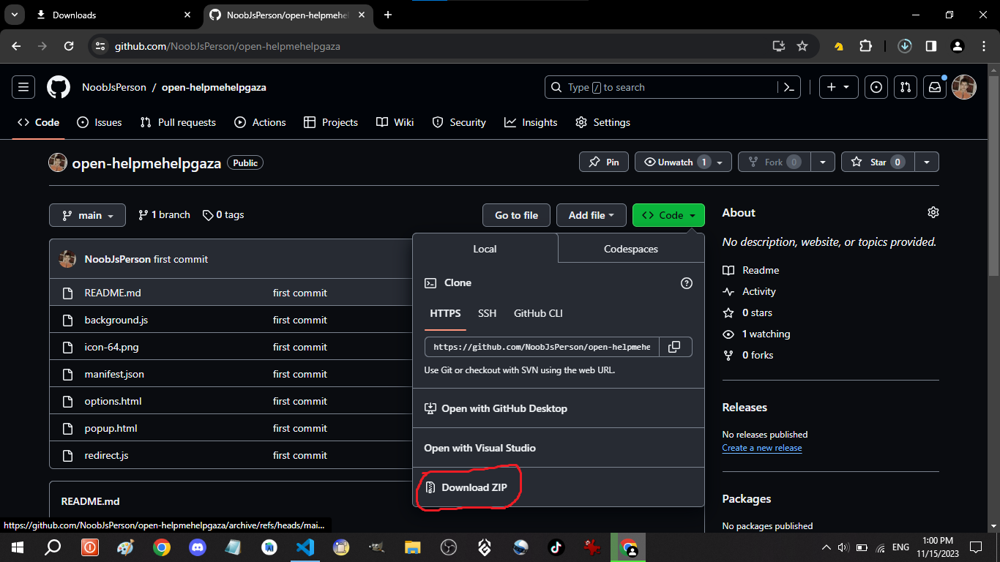
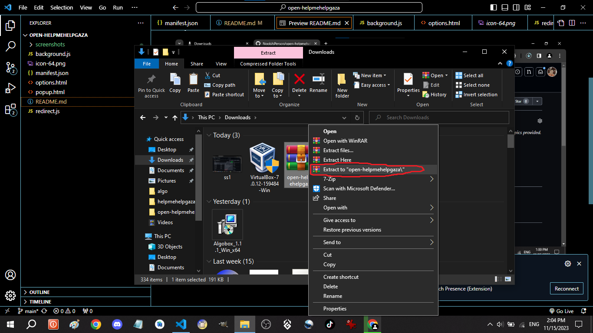
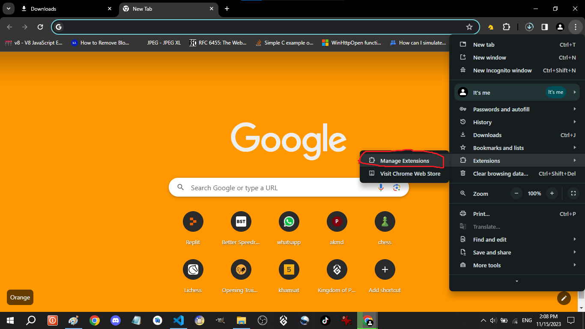
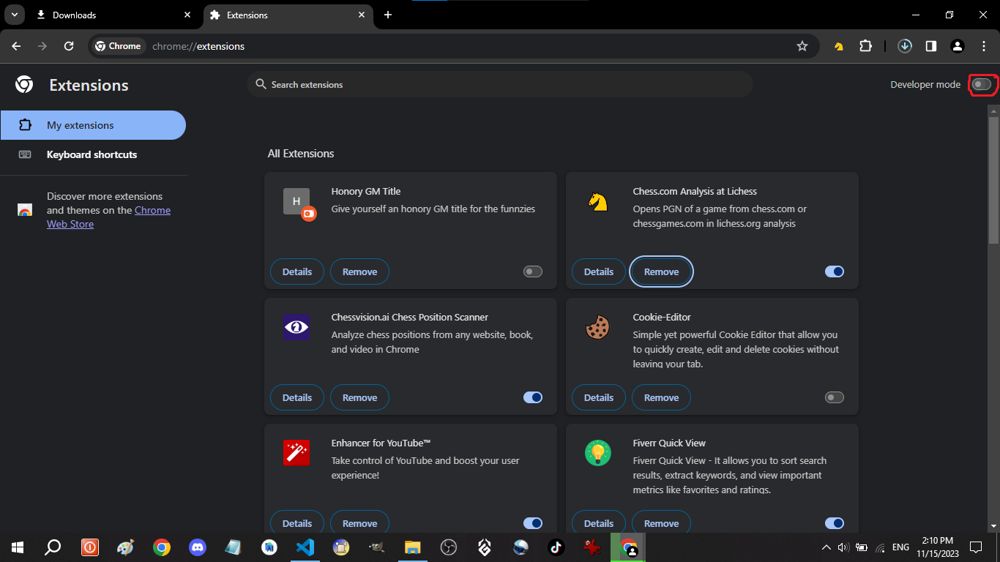
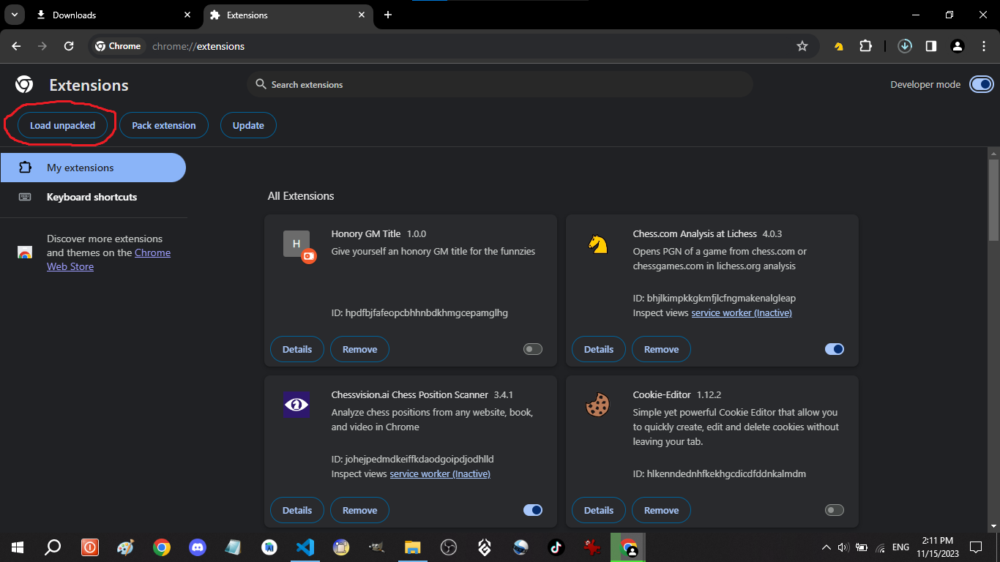
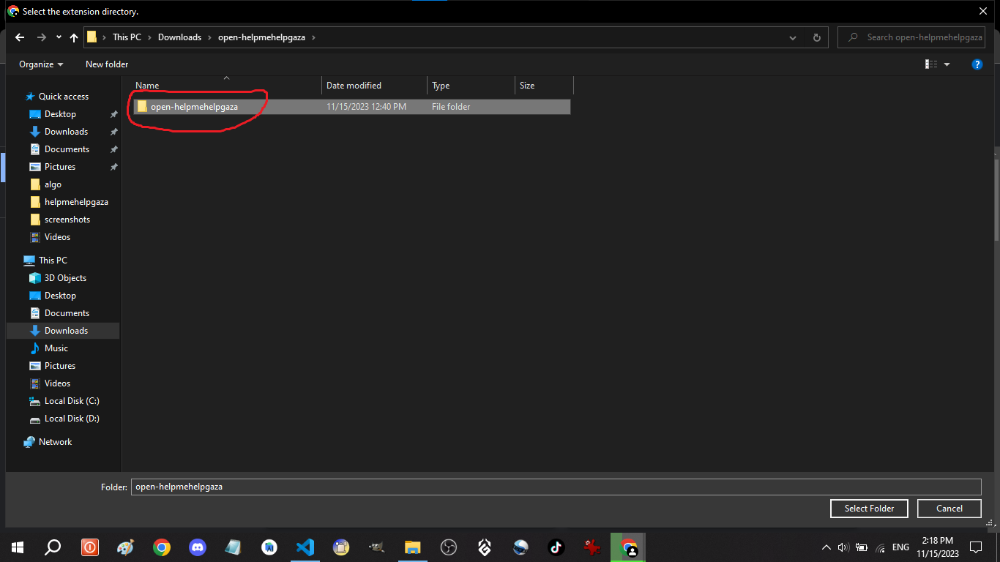
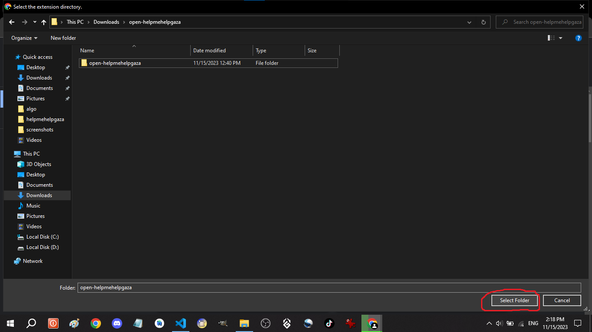
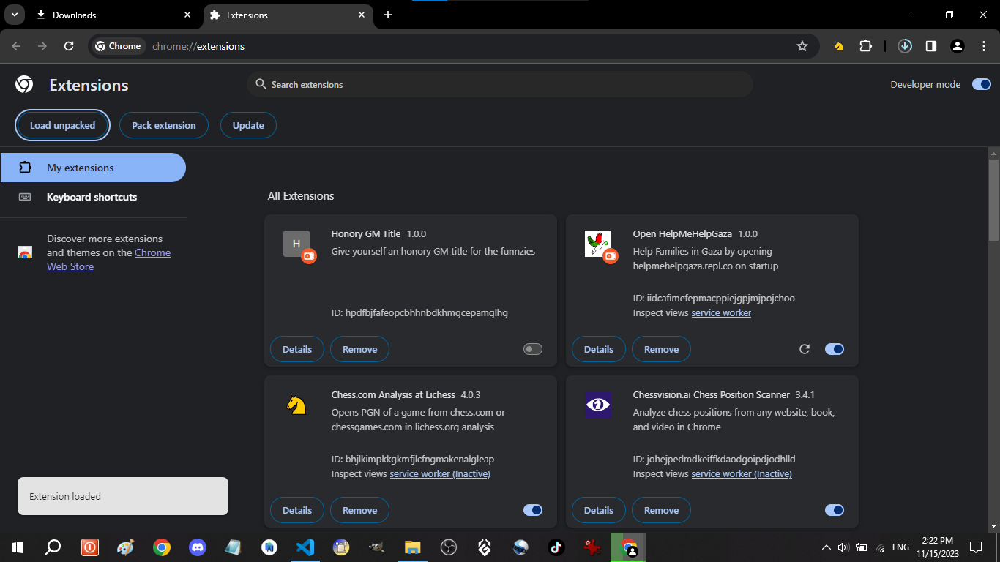

# Open HelpMeHelpGaza
A chrome extension that opens [HelpMeHelpGaza](helpmehelpgaza.repl.co) on startup so you can help families in gaza each time you open your browser
## Setup
this is how you install the extension
### Step 1: Download the code

### Step 2: Unzip the files

### Step 3: Go to chrome extension settings and enable Developer Mode

### Step 4: Load the extension

Find the extension file (to make sure its the right one open it, you should find a folder inside of it called `screenshots`)

You should see the extension being installed like this:

Now you have sucessfully installed the extension and contributed to help families and Gaza. You rock!
If you have faced any problem with installing or using the extension, feel free to make an issue with info about how to replicate it if possible.

